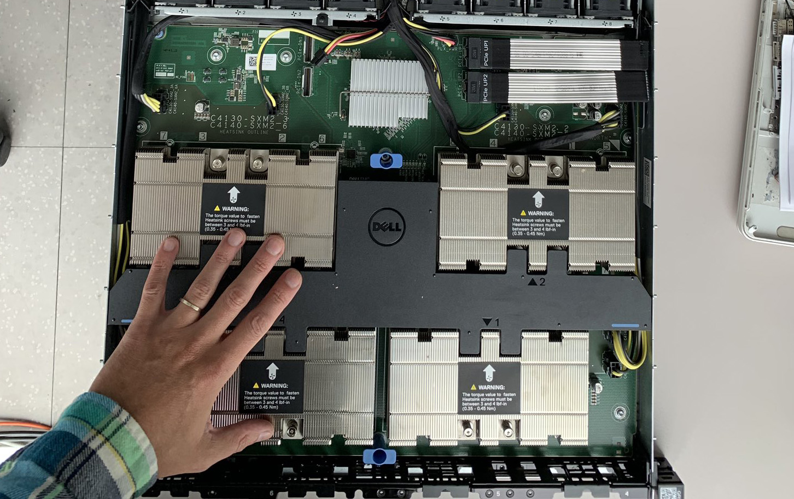

# Building a poor man's supercomputer

## TL;DR
I've built a 4x V100 box for less than $5,500.

<b>NOTE:</b> If you intend to use 32Gb Voltas with Dell PowerEdge C4130, check my ["Reverse engineering Dell iDRAC to get rid of GPU throttling"](https://github.com/l4rz/reverse-engineering-dell-idrac-to-get-rid-of-gpu-throttling) writeup.

## Intro

I prefer to use my own gear for personal projects rather than cloud services.

I have a rich experience of dealing with used carrier and enterprise grade equipment. Used server components, especially those of previous generations, are substantially cheaper compared to consumer (and especially enthusiast-class) hardware. For instance, a 32Gb DIMM of ECC DDR4 can be bought for $100, maybe less while buying in bulk, while the similar consumer grade DDR4 DIMM (sans ECC and with slightly faster clocks) retails for $150 on Newegg. A pair of entry level 4-6 core v3 Xeon CPUs can be bought for $25. And so on. The sell potential for any kind of used hardware that cannot be plugged to a consumer PC is limited and the supply is abundant, thanks to hardware liquidators.

The same applies, to a certain degree, for GPUs. Used NVidia accelerators in SXM2/SXM3 form factor are significantly less expensive when compared to PCIe ones. It is possible to build a box with enough compute for ML jobs and capable of training, e.g. a full-resolution StyleGAN2 in a few days, for a fraction of the list price of a similar vendor-supplied server.

In the CUDA world, one can choose between consumer (RTX) or enterprise (Tesla) accelerators. Prior to the debut of the RTX 3000 series, my alternatives were either a Titan RTX (24GB) or a Tesla V100 (16/32GB), since I needed at least 16GB of VRAM.

## Procuring the parts

Early 2020 I bought a couple of Tesla V100s for $1000 (SXM2, 16Gb) each after seeing them on eBay and deciding what to do with them. They've made some excellent doorstops, I'm sure.

*Tesla V100 SXM2*

A Chinese vendor `fuboliya` was selling a barebone Dell C4130s consisting of 1U enclosure, motherboard and SXM2 board for slighly less than $2000. I was considering purchasing one of these and shopping for all cables, fans, and other accessories, but then I came across a Dell SXM2 carrier board, Dell P/N `0CTHR`, for $50 on a European hardware liquidator's website, with $50 PCIe interconnect cable (Dell P/N `GM46T`).

*A spare Dell C4130 motherboard and SXM2 carrier board*

I bought an used Dell C4130 (System Config D - with two slots for double-width full-height, full-length (FHFL) GPUs) for $700, as these were abundant on eBay. It came with two PCIe risers. I removed these and the SXM2 board slid in well. I bought a couple of required power cables from the motherboard PDU to the SXM2 board on eBay for $10-20 each:

* 1x 14 pin to 2x 10 pin "GPU 1/2" Dell P/N `N5FX4`
* 1x 10 pin to 4x 8 pin "PLX_PWR" Dell P/N  `28TH5`
* 1x 10x pin to 8x pin "GPU 4" Dell P/N `XNNN1`
* 1x 10x pin to 8x pin "GPU 3" Dell P/N `06GXV`

(Note that even with 4x GPUs fitted, the system will work without one of GPU 3 or GPU 4 cables)

*Assembly in progress, no accelerators installed yet*

When the system was turned on, the `lspci` output showed PLX 8796 bridge device, suggesting that the SXM2 board was working properly.

## Heatsinks

The GPU heatsinks were the only thing that was needed at this point.

*Factory installed heatsinks in the similar Dell C4140 server*

The original heatsinks, Dell P/N `JNMFW`, are also extremely rare, as those were only used in C4130/C4140 servers. I couldn't find these parts through Dell distribution. eBay offers were around $300-500 per piece and here was a vendor on Taobao offering them for ¥700 ($100), but I didn't like the idea of buying heatsinks for $100 (after all, this is a poor man's supercomputer!).

*OG heatsink*

If I were building a box to be installed in my basement, I'd probably go with a water cooled setup but it was not a option because I planned to host my server in a datacenter, so I decided to fabricate heatsinks, designed to fit into 1U server.

Looking at the design of the original heatsink and checking dimensions at a [Supermicro heatsink compatibility matrix](https://www.supermicro.com/en/support/resources/heatsink), I decided that two Supermicro SNK-P0037P CPU heatsinks (available for $5-15 each on eBay) joined by a heat conducting plate might work.

*The design after a few prototype iterations*

Despite looking like a solid chunk of metal, these heatsinks have a couple of heatpipes in their base plate. It's critical not to pierce these heatpipes during assembly and/or drilling holes for screws affixing heatsink assemblies to the GPU frame. (Yeah I've managed to trash a couple of them). I was able to clear the pipes by spacing two heatsinks 6-7mm apart. So the final design required soldering a couple of fins to the center of a 5mm copper plate and screwing everything together.

*The design after a few prototype iterations*

I put thermal grease between copper and heatsinks, as well for the GPU die. Due to its lesser thickness, it is superior to heat pads in the correct application. Simply ensure the grease is dielectric; with Q-tips soaked in petroleum ether, wipe away the excess. Using thermal adhesive, I've attached two aluminium bars to cool the VRM MOSFETs on Voltas. I've also put some heatpads.

*Ready to install*

It's critical to keep these GPUs cool. Because of HBM2 memory fragility, Teslas are limited to 85°C memory temperature, compared to 100-105°C for consumer GPUs. While testing in my room, with warm summer air, GPUs temperatures were fluctuating below 75°C with the server lid closed and GPU power limit set to 280W (around the Max-Q value). It was supposed to be even better with chilled air in the dataceter. I fabricated more heatsinks and put everything together.

*Almost there*

The only issue was that the top lid wouldn't close with the height of the SNK-P0037P. With some aluminum HVAC tape, the problem was solved; the 1U server became 1.25 or so U, but I didn't mind.

(By the way, installing SXM2 GPUs turned out to be a rather easy procedure. It does not necessitate a $350 digital torque wrench, as it was suggested in some YouTube video. According to a study conducted by bone surgeons, the average peak torque required to achieve two finger tightness is 0.25 N-m. This is significantly less than the 0.50 N-m maximum torque permitted for SXM2 screws. It should be good enough for GPUs if it's good enough for bone surgery. Simply tighten the screws in the correct order.)

Stress test revealed that keeping power limit at 250W is preferable, taking into account the airflow with all four GPUs mounted. The GPU temperatures remained in the upper 60s and low 70s. Surprisingly, my design, with a solid copper block, kept HBM2 memory cooler than the stock one. It could probably be improved even more by adding a couple of heatpipes or replacing the copper block with a vapor chamber.

Stress test revealed that, taking into account the airflow with all 4 GPUs installed, it's better to keep PL at 250W. The GPUs temps stayed in high 60s / low 70s. Interesting enough, my design (with a solid copper block) provided better cooling for HBM2 than stock. Probably it could be improved further, by adding a couple of heatpipes, or substituting a copper block with vapor chamber.

*Watching the temps*

## The budget and parts list

The following parts were purchased:

* Tesla V100 GPUs: $4100 for 4x
* Dell SXM2 board $50
* Dell C4130 barebones with 2x PSU $700
* Cables $100
* A pair of E5-2620 v3 Xeons $50
* 64Gb DDR4 $200
* 1TB NVME SSD + PCIe board $100
* Heatsinks and thermal compounds $100

So, it was $5400 for a 4x V100 box. Not bad!

The relevant Dell parts that may be required or not, just for the reference:
* Dell C4130 motherboard, `YGHM5` / `797FV` /  `VCHW8`
* NVLINK BOARD `0CTHR` (2016) / `96PWG` (newer design for both C4130 and C4140). Note that C4130 and C4140 share the same SXM2 board but everything upstream from SXM2 board is different.
* Dell PowerEdge C4130 PCle NVL Signal Cable `GM46T` (the one that connects the SXM2 board)
* 2x1.8 inch SATA riser `35RMH`
* 2x PCIE riser  (for network cards, etc) `H9WYF`
* Dell C4130 CPU heatsink `Y8MC1`
* Chassis fans `9XXJ9`
* 4X SATA cable `7N2GJ` (This one is weird. It is designed for conifiguration when you replace one PSU with 4x 2.5" SATA drive bay)
* Plastic GPU shroud: `M7NX3`
* Front control panel cable: `6WTR5` (The front panel is optional; you can power up the server via IDRAC)
* Dell 1600-Watts 80 Plus Platinum Hot-Pluggable Power Supply for PowerEdge C4130 `95HR5` (the 2400W `J1CC3` is also fine)

It should be noted that server runs fine with any number of SXM2 GPUs. You don't need to install all four.

The SXM2 board, as well as accelerators, were operational after Ubuntu loaded, without any additional drivers. I've never had to configure or reflash anything. My V100s were pulled from Dell computers as well (Dell p/n `0YMV9T`). Three ones were used and one more was new.

[Dell C4130 manual](https://dl.dell.com/topicspdf/poweredge-c4130_owners-manual_en-us.pdf) for the reference.

## Update (July 2021)

The server has been up and running for about a year without any issues.

RTX 3090 cards have become an attractive alternative for building an ML box since the arrival of the RTX 3000 series (the consumer Ampere). It's possible to fit two RTX 3090 in a $700 Dell C4130; such a project would involve stripping the cards of stock cooling hardware and fabricating some custom heatsinks to operate in axial airflow conditions and cooling the GDDR6X chips on the back. Power cables have to be fabricated as well. A couple of notes on performance of RTX 3090:

* For FP32 tasks, 3090 typically outperforms the V100 while consuming slightly more power. Despite the indicated 35TFLOPS of FP32 compute (versus 15TFLOPS in case of V100), the memory bandwith of GDDR6X severely limits its performance.

* For FP16 tasks, 3090 indeed produces some speedup (due to less memory transfers involved) but it is nowhere near 2X like it was with consumer Turing, since the space allocation on GA102 chip in 3090 is shifted towards FP32 cores. V100 still beats the 3090 in FP16.

* 3090 support the new TF32 training mode introduced in Ampere (float32 ops are calculated by tensor cores in 10-bit mantissa, 8-bit exponent) and it does provide some speedup though it is limited.

Some real-life figures:

StyleGAN2 training (stylegan2-ada-pytorch, config-f, 512px), default mixed precision settings (num_fp16_res=4)
* 3090: FP32: 111 s/kimg, TF32: 76 s/kimg
* V100: FP32: 95 s/kimg
* A100: FP32 53 s/kimg, TF32 52 s/king

StyleGAN2 training (stylegan2-ada-pytorch, config-f, 512px), no mixed precision (num_fp16_res=0)
* 3090: FP32: 125 s/kimg, TF32: 114 s/kimg
* V100: FP32: 160 s/kimg
* A100: FP32 114 s/kimg, TF32 64 s/king

ResNet50 training (Imagenet)
* 3090: FP32: 430 img/s, TF32: 430 img/s, AMP: 520 img/s
* V100: FP32: 355 img/s, AMP: 1130 img/s
* A100: FP32: 490 img/s, TF32: 790 img/s, AMP: 2140 img/s

## Written by

l4rz
